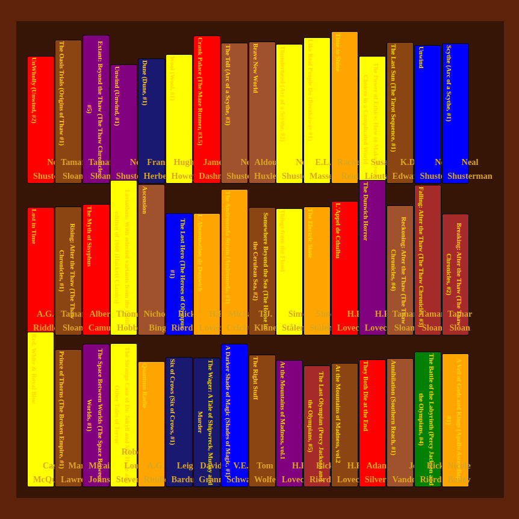

# Personal Library Display Application

### Created by Brandon Sharp

## Description
This program displays a bookshelf from the information given to it by a goodreads bookshelf csv file.

## Getting Started
The first thing you will need to do is create a goodreads account if you do not already have one.
Once you have created one and added your books that you have read to it, you can then follow the below instructions to get a csv file with your books to use as input for this program.
1) Go to goodreads.com and sign in.
2) Click on 'My Books' in the navigation bar at the top of the webpage.
3) On the left side of the screen, click 'Import and export' from the selections.
4) At the top, click 'Export Library'
5) Lastly, click on 'Your export from ##/##/#### - ##:##' to download the file. Make sure you remember where you downloaded this file to.

## Using The Program
To have the program create the library from your csv file, on the webpage, click 'Choose File'.
Use the csv file that you downloaded earlier.
Then click the 'Submit' button.

## Output
The webpage now displays your bookshelf with the Titles and Authors (Example Shown Below).

## Explanation
This program uses two main utilities to create this bookshelf:

1) Pandas: For creating a dataframe of the 'Title' and 'Author' rows from the provided csv file.
2) Flask: For retrieving and sending data to and from the webpage.

Below is the main explaination of the code in the books.py file:
1) Sets up pandas and Flask to use for the webpage.
2) Sets the main path for the webpage to be able to have GET and POST requests using Flask.
3) Gets the csv file uploaded by the user and stores it in this directory.
4) Stores the 'Title' and 'Author' columns from the csv file as a pandas DataFrame.
5) Creates a list of books where each book is a list with its title and author as the elements.

## Purpose
This website is used for those who do not own the books that they have read. With this program, they can now 'virtually' view their bookshelf with all of the books that they have read.

## Future Development Goals
I plan on adding several more features and display changes to improve the user experience.

1) Fix title and author text to not go off of their book.
2) Change the title and author text color depending on the color of the book.
3) Create several bookshelves based on the number of books instead of one long bookshelf.
4) Add different pages to the website:
    
    * Stats Page: Shows graphs on the types of books that the reader reads and their rating based on each genre.
